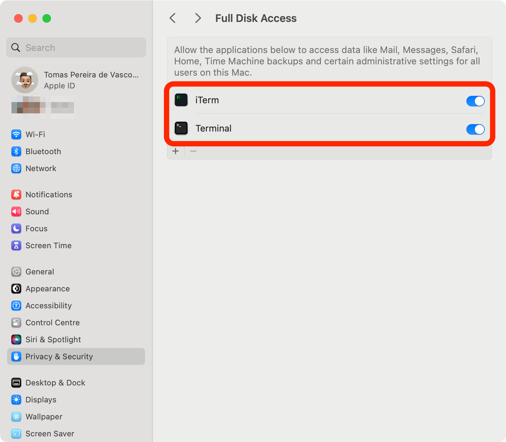

# My dotfiles

Welcome to my personal [dotfiles](https://wiki.archlinux.org/index.php/Dotfiles)!

This repository contains instructions, configuration files, and bootstrapping scripts for setting up a new macOS machine from scratch. It helps me keep a reproducible workflow for setting up and maintaining my macOS development environment across multiple machines. It also serves as a backup for my configuration files, and a way to share my setup with others.

Feel free to steal, modify, and/or adapt! 🚀

## Table of Contents

* [Table of Contents](#table-of-contents)
* [Fresh macOS Install (step-by-step)](#fresh-macos-install-step-by-step)
    * [First things first](#first-things-first)
    * [Cloning this repository](#cloning-this-repository)
    * [Installing Homebrew](#installing-homebrew)
    * [Unlocking this repository](#unlocking-this-repository)
    * [Bootstrap](#bootstrap)
* [Appendix](#appendix)
    * [Other useful macOS settings](#other-useful-macos-settings)
    * [Update everything](#update-everything)
    * [Check for issues](#check-for-issues)
    * [Reclaim some disk space](#reclaim-some-disk-space)
    * [Shell setup](#shell-setup)
    * [Install Python Development Tools](#install-python-development-tools)
* [References](#references)

<!-- Created by https://github.com/ekalinin/github-markdown-toc -->

## Fresh macOS Install (step-by-step)

The following steps assume that you are starting from a fresh macOS installation. If that’s not the case, feel free to skip some of the steps at your own discretion.

Before you start, make sure you have a good internet connection and that you are not running on battery power. Depending on your machine's hardware and internet connection, some of the steps below could take a while to complete, and you don't want to run out of battery in the middle of the process.

### Requirements

> [!IMPORTANT]
> The following prerequisites are essential for successfully setting up your macOS machine. Without them, you will almost certainly run into issues during the bootstrapping process.

1. Make sure you have [admin access](https://support.apple.com/en-gb/guide/mac-help/mtusr001/mac) to your macOS machine.
2. Make sure you are logged in with a valid Apple ID (check both [System Preferences](https://support.apple.com/en-gb/guide/mac-help/mchla99dc8da/mac) and the [App Store](https://support.apple.com/en-gb/guide/app-store/fir6253293d/mac)).
3. Make sure you've opened and quit both Safari and the Mail app at least once. This is necessary to make sure their respective system preferences files have been created.
4. Some of the steps in the bootstrapping script below might require [full disk access](https://support.apple.com/en-gb/guide/mac-help/mchl211c911f/mac) from your terminal emulator. This is something that you probably want to enable anyway. For instance, iTerm2 will [ask you](https://gitlab.com/gnachman/iterm2/-/wikis/fulldiskaccess) to give it full disk access at first launch. Do to this, navigate to `System Preferences -> Privacy & Security -> Full Disk Access` and toggle the checkbox for your terminal emulators.
   

### Cloning this repository

To clone this repository under `~/.dotfiles`, run the following command:

```shell script
git clone https://github.com/tpvasconcelos/dotfiles.git ~/.dotfiles
```

This directory will contain all the necessary scripts and configuration files to set up your macOS machine. Again, feel free to fork, modify, and adapt any of the files to suit your own needs and preferences.

> [!NOTE]
> At this point, you should be prompted to install macOS's [Command Line Developer Tools](https://developer.apple.com/downloads/). Please follow the steps in the user interface. If for some reason you are not prompted at this point, don't worry, as we will verify these requirements later on during the [bootstrapping](#bootstrap) process.

### Installing Homebrew

I use [Homebrew](https://brew.sh) (`brew`) as my go-to macOS package manager. Rare are the cases where Homebrew is not enough! Run the following command to [install Homebrew](https://brew.sh/#install) on your machine.

```shell script
/bin/bash -c "$(curl -fsSL https://raw.githubusercontent.com/Homebrew/install/HEAD/install.sh)"
```

To make `brew` available on your shell, you'll need to run the following command first. Note that you won't have to do this again, after you finish going through the [bootstrap](#bootstrap) instructions.

```shell script
eval "$(/opt/homebrew/bin/brew shellenv)"
```

### Unlocking this repository

Some files in this repository are encrypted using [`git-crypt`](https://github.com/AGWA/git-crypt). This allows me to pick and choose which dotfiles I want to publicly share and which ones I would like to keep private. You can see the full list in the `.gitattributes` file. You might want to do the same thing when maintaining your own fork.

Starting from a fresh macOS installation, you will need to install the following dependencies using Homebrew:

```shell script
brew install gnupg git git-crypt
```

Then, you will need to import your private GnuPG key (I keep mine safely stored in [my password manager](https://www.dashlane.com/)). You can do this by saving your key in a local temporary text file (e.g. `/tmp/gpg-private.key`), and then run:

```shell script
gpg  --import --allow-secret-key-import /tmp/gpg-private.key
```

Finally, you can unlock the repository using the imported GnuPG key with

```shell script
git-crypt unlock
```

**Note:** here's how you can print your current GnuPG keys to stdout

```shell script
gpg --export --armor $GPG_KEY_ID
gpg --export-secret-keys --armor $GPG_KEY_ID
```

### Bootstrap

The following shell script will run all necessary installation and configuration steps. Feel free to peak inside to see what’s going on. It is recommended to reboot your machine after running this script for the first time. For convenience, the script will prompt you for an automatic reboot at the end.

```shell script
cd ~/.dotfiles && ./bootstrap.zsh
```

> [!NOTE]
> By default, this script will install a bunch of Python versions (using `pyenv`). If you want to control which versions are installed, you can expose a `PYENV_VERSIONS` environment variable with a space-separated list of Python versions. For example, to only install Python 3.8 and Python 3.9, run: `PYENV_VERSIONS="3.8.9 3.9.3" ./bootstrap.zsh`. Check inside the `bootstrap.zsh` script to see which versions are installed by default.

> [!TIP]
> There are no unwanted side effects from running this script multiple times, and the steps that have already run successefully will simply be skipped. So, if you encounter any issues, feel free to just run the `./bootstrap.zsh` script again (once you've fixed the underlying error on your end).

## Appendix

### Other useful macOS settings

Take a look at this [_awesome_ reference](https://git.herrbischoff.com/awesome-macos-command-line/about/) where you will find a lot of cool ways to personalise your Mac. My default settings can be found in the `scripts/macos.zsh` script.

I'll highlight one important example here... From the [macOS User Guide](https://support.apple.com/en-gb/guide/mac-help/mh35890/mac), you have the option to add a message on the Mac login window. It can be used _"to provide contact information for a misplaced computer."_

```shell script
sudo defaults write /Library/Preferences/com.apple.loginwindow LoginwindowText "If lost, please contact your_email_here@example.com"
```

### Update everything

If you want to update everything with a single command, you can run

```shell script
hc-update-everything --system --brew-greedy-latest --flutter
```

For simple routine updates, you can just call the `hc-update-everything` script without any arguments.

```shell script
hc-update-everything
```

For more details see the `hc-update-everything` function definition at [shell/functions/hc.zsh](https://github.com/tpvasconcelos/dotfiles/blob/main/shell/functions/hc.zsh).

```console
$ hc-update-everything --help
Usage: hc-update-everything [OPTIONS]

Options:
    --system              Run a system software update first
    --brew-greedy-latest  Also update brew casks with a :latest version tag
    --flutter             Also update Flutter and Dart
    --help                Show this help message and exit
```

### Check for issues

Run `hc-doctor` to check for issues with your system's state or configuration. This script will run a series of checks such as:

- Check for outdated software
- Check for issues with this .dotfiles repository
- Verify the status of your GnuPG keys
- Check for issues with your installed brew packages (brew doctor) or brew bundle (installed packages not listed in the global Brewfile)

```shell script
hc-doctor
```

### Reclaim some disk space

In order to reclaim some disk space, you can occasionally clear caches from tools like brew and pip, or permanently clear unused data from tools like Docker by running the following helper:

```shell script
hc-reclaim-diskspace
```

For more details see the `hc-reclaim-diskspace` function definition at [shell/functions/hc.zsh](https://github.com/tpvasconcelos/dotfiles/blob/main/shell/functions/hc.zsh).

```console
$ hc-reclaim-diskspace --help
Usage: hc-reclaim-diskspace [OPTIONS]

Options:
    --cleanup-brew-bundle  Uninstall all dependencies not listed in the Brewfile
    --help                 Show this help message and exit
```

### Shell setup

Here I'm using a bare [oh-my-zsh](https://github.com/ohmyzsh/ohmyzsh/) configuration with a
[powerlevel10k](https://github.com/romkatv/powerlevel10k) theme. You can consider other frameworks,
such as:

- [prezto](https://github.com/sorin-ionescu/prezto) - The configuration framework for Zsh
- [zinit](https://github.com/zdharma/zinit) - Ultra-flexible and fast Zsh plugin manager with clean
  fpath, reports, completion management, Turbo, annexes, services, packages.
- [zplug](https://github.com/zplug/zplug) - A next-generation plugin manager for zsh
- [antibody](https://github.com/getantibody/antibody) - The fastest shell plugin manager.

The rules that define whether a startup script is sourced (and in which order) differ depending on
the UNIX shell, initialization strategy, and even operating system. To keep things simple, we’ll
focus only on the zsh shell on a macOS system.

- When opening a new terminal shell on a terminal emulator such as iTerm2 or Terminal, the following
  files get sourced in the following order: `.zshenv --> .zprofile --> .zshrc --> .zlogin`. You are
  now using an _interactive login shell_. Once you kill the current shell, the `.zlogout` script
  will be sourced before killing the process.
- If you source a script (e.g. `source some_script` or `. ./some_script`), no startup files get
  sourced. This is because `source` reads and executes the contents of your script _within_ the
  **current** shell environment.
- If you run a script as an executable (e.g. `./some_script`), the script will run in a **new
  shell**. By default, and in most cases, this will be a non-interactive non-login shell and,
  therefore, only `.zshenv` will be sourced before executing the script. You can extend this logic
  _ad infinitum_... if this script calls yet another script, which in turn calls yet again another
  script, etc, etc... each one will run in a new shell. Here I’m assuming that the script will be
  executed within a zsh shell, of course! If the script contains a `#!/usr/bin/env zsh` shebang line,
  it can be executed directly as `./some_script` or called as a regular command if it exists under
  `$PATH`. Alternatively you can explicitly execute the script as `zsh some_script`.

### Install Python Development Tools

I use [pyenv](https://github.com/pyenv/pyenv) to manage multiple Python versions. I have also
defined some extra utilities under `shell/functions/tau.zsh` to make it easier to install and
manage these multiple installations.

## Todo

- [ ] Create Zsh functions
    - [lukeojones - 1UP your Zsh abilities by autoloading your own functions](https://dev.to/lukeojones/1up-your-zsh-abilities-by-autoloading-your-own-functions-2ngp)
    - [An Introduction to the Z Shell - Shell Functions](http://zsh.sourceforge.net/Intro/intro_4.html)
    - [The Z Shell Manual - Functions](http://zsh.sourceforge.net/Doc/Release/Functions.html)

## References

* [Awesome dotfiles](https://github.com/webpro/awesome-dotfiles) - A curated list of dotfiles
  resources.
* [The "Hacker News Comment" Method](https://news.ycombinator.com/item?id=11070797) - This Hacker
  News comment popularised the "bare repository and alias method" for managing dotfiles. This method
  is also references in
  [Dotfiles (ArchWiki)](https://wiki.archlinux.org/index.php/Dotfiles).
* [Awesome macOS Command Line](https://github.com/herrbischoff/awesome-macos-command-line) -
  inspiration for most of the settings in [macos.zsh](scripts/macos.zsh).
* [A User's Guide to the Z-Shell - What to put in your startup files](http://zsh.sourceforge.net/Guide/zshguide02.html)
* <https://github.com/grant/new-computer-checklist>
* <https://github.com/unixorn/awesome-zsh-plugins>
* <https://specifications.freedesktop.org/basedir-spec/basedir-spec-latest.html>
* <https://github.com/iCHAIT/awesome-macOS>
* [A collection of useful .gitignore templates](https://github.com/github/gitignore)
* [Shell startup scripts](https://blog.flowblok.id.au/2013-02/shell-startup-scripts.html) - An
  article about standardizing shell startup scripts.
