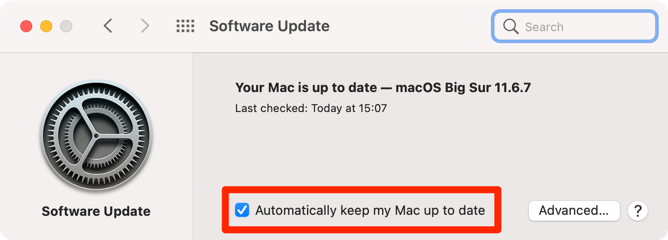

# My dotfiles

Welcome to my personal [dotfiles](https://wiki.archlinux.org/index.php/Dotfiles)! This repository
helps me keep a reproducible workflow for setting-up and maintaining my macOS development
environment, configuration files, system preferences, and even all my desktop applications.

## Table of Contents

* [Fresh macOS Install (a step-by-step guide)](#fresh-macos-install-step-by-step)
    * [Cloning this repository](#cloning-this-repository)
    * [Installing Homebrew (brew)](#installing-homebrew-brew)
    * [Unlocking this repository](#unlocking-this-repository)
    * [Bootstrap](#bootstrap)
* [Appendix](#appendix)
    * [Setup ssh for git](#setup-ssh-for-git)
    * [Misc](#misc)
    * [Update everything](#update-everything)
        * [Install any pending software updates](#install-any-pending-software-updates)
    * [Install Xcode and Command Line Developer Tools](#install-xcode-and-command-line-developer-tools)
    * [Shell setup](#shell-setup)
    * [Install Python Development Tools](#install-python-development-tools)
    * [Check for issues](#check-for-issues)
    * [Reclaim some disk space](#reclaim-some-disk-space)
* [Todo](#todo)
* [References](#references)

## Fresh macOS Install (step-by-step)

The following steps assume that you are starting from a fresh macOS installation. You should also
have [admin access](https://support.apple.com/en-gb/guide/mac-help/mtusr001/mac) to your macOS
machine. In addition to this, you will also need to be logged-in with a valid Apple ID (check
both [System Preferences](https://support.apple.com/en-gb/guide/mac-help/mchla99dc8da/mac), and the
[App Store](https://support.apple.com/en-gb/guide/app-store/fir6253293d/mac)).

### Cloning this repository

Start by cloning this repository under `~/.dotfiles`

```shell script
git clone https://github.com/tpvasconcelos/dotfiles.git ~/.dotfiles
```

**New in macOS Big Sur -** At this point, you will be prompted to install macOS's
[Command Line Developer Tools](https://developer.apple.com/downloads/). Simply follow the steps in
the user interface dialog. If this did not work for you, or you are on an older version of macOS,
follow the step in the
[Install Xcode and Command Line Developer Tools](#install-xcode-and-command-line-developer-tools)
section in the Appendix.

Don't forget to change your working directory to the checked-out repository

```shell script
cd ~/.dotfiles
```

### Installing Homebrew (brew)

I use [Homebrew](https://brew.sh) (`brew`) as my go-to macOS package manager. Rare are the cases
where Homebrew is not enough! Run the following command to install Homebrew or explore other
[installation options](https://docs.brew.sh/Installation).

```shell script
/bin/bash -c "$(curl -fsSL https://raw.githubusercontent.com/Homebrew/install/HEAD/install.sh)"
```

### Unlocking this repository

Some of the files in this repository are encrypted using
[`git-crypt`](https://github.com/AGWA/git-crypt). This allows me to pick and choose which dotfiles I
want to publicly share and which ones I would like to keep private. You can see the full list in the
`.gitattributes` file. You might want to do the same thing when maintaining your own fork.

Starting from a fresh macOS installation, you will need to install the following dependencies using
Homebrew:

```shell script
brew install gpg git git-crypt
```

Then, you will need to import your private GnuPG key (I keep mine safely stored
in [my password manager](https://www.dashlane.com/)). You can do this by saving your key in a local
temporary text
file (e.g. `/tmp/gpg-secret.key`), and then run

```shell script
gpg  --import --allow-secret-key-import /tmp/gpg-secret.key
```

Finally, you can unlock the repository using the imported GnuPG key with

```shell script
git-crypt unlock
```

**Note:** here's how you can print your current GnuPG keys to stdout

```shell script
gpg --export --armor $GPG_KEY_ID
gpg --export-secret-keys --armor $GPG_KEY_ID
```

### Bootstrap

The following shell script will run all necessary installation steps. Have a look inside this script
to inspect all steps. **Warning: It is recommended to reboot your machine after running this script
for the first time.** For convenience, this script will prompt you for an automatic reboot at the
end 💪

```shell script
./bootstrap.zsh
```

There are no unwanted side effects from running this script multiple times. So, if you encounter any
errors, feel free to just run it again.

## Appendix

### Setup `ssh` for `git`

For a more detailed guide, look at the official documentation from
[GitHub](https://help.github.com/en/articles/connecting-to-github-with-ssh),
[Bitbucket](https://confluence.atlassian.com/bitbucket/set-up-an-ssh-key-728138079.html#SetupanSSHkey-ssh2)
, and [GitLab](https://docs.gitlab.com/ee/ssh/). However, if you are just looking for a reminder,
use the snipped bellow

```shell script
yes | ssh-keygen -P "" -f ~/.ssh/id_rsa
eval "$(ssh-agent)"
/usr/bin/ssh-add -K ~/.ssh/id_rsa

# Here, we are copying the public key to the clipboard.
# After running this, add it to your GitHub/GitLab/Bitbucket known SSH keys!
pbcopy < ~/.ssh/id_rsa.pub
```

### Other useful macOS settings

Take a look at
this [_awesome_ reference](https://git.herrbischoff.com/awesome-macos-command-line/about/) where you
will find a lot of cool ways to personalise your Mac. My default settings can be found in
the `macos.zsh` file.

I'll highlight one important example here... From
the [macOS User Guide](https://support.apple.com/en-gb/guide/mac-help/mh35890/mac), you have
the option to add a message on the Mac login window. It can be used _"to provide contact information
for a misplaced computer."_

```shell script
sudo defaults write /Library/Preferences/com.apple.loginwindow LoginwindowText "If lost, please contact your_email_here@example.com"
```

### Update everything

#### Software Update

It is generally a good idea to keep your machine up-to-date and install software updates and
security patches as often as possible. You can configure your Mac to automatically install these in
the background by making sure you have this configured in your System Preferences.



Alternatively you can invoke this via the command line. You should reboot your machine after
running this command or, instead, just add an optional ` --restart` flag so that it restarts
automatically.

```shell script
sudo softwareupdate --install --all --verbose --force --agree-to-license
```

#### Brew packages

```shell script
brew update
brew bundle --global --no-lock
brew upgrade
```

In order to also update casks that only have a `:latest` version tag, pass the
optional `--greedy-latest` flag. Note that this could be an expensive operation.

```shell script
brew upgrade --greedy-latest
```

### Check for issues

Run `brew doctor` to check for any hanging issues

```shell script
brew doctor
```

### Reclaim some disk space

Safely delete some `CoreSimulator` caches used by Xcode

```shell script
xcrun simctl delete all && xcrun simctl erase all
rm -rf ~/Library/Developer/CoreSimulator/Caches/*
```

You can occasionally also clear your caches for tools like Homebrew and `pip`

```shell script
# Uninstall all dependencies not listed in the Brewfile
brew bundle cleanup
# clear homebrew's caches
brew cleanup -s

# Clears caches (pipenv, pip, and pip-tools)
pipenv --clear

# Remove docker's unused data
docker system prune --volumes
```

### Install Xcode and Command Line Developer Tools

1. Start by downloading Xcode from the App Store. Once this download is complete, run the following
   shell commands from the Terminal app.
1. Here, we will install the Command Line Developer Tools. The first command ensures `xcode-select`
   is pointing to the correct (active) developer directory. Follow the installation steps that will
   open in a user interface dialog and proceed to the next step.
    ```shell script
    sudo xcode-select --switch /Applications/Xcode.app/Contents/Developer
    xcode-select --install
    ```
1. As a final step, you'll need to accept the Xcode and SDK license agreements. The second command
   will also install any missing packages.
    ```shell script
    sudo xcodebuild -license accept
    sudo xcodebuild -runFirstLaunch
    ```

### Shell setup

Here I'm using a bare [oh-my-zsh](https://github.com/ohmyzsh/ohmyzsh/) configuration with a
[powerlevel10k](https://github.com/romkatv/powerlevel10k) theme. You can consider other frameworks,
such as:

- [prezto](https://github.com/sorin-ionescu/prezto) - The configuration framework for Zsh
- [zinit](https://github.com/zdharma/zinit) - Ultra-flexible and fast Zsh plugin manager with clean
  fpath, reports, completion management, Turbo, annexes, services, packages.
- [zplug](https://github.com/zplug/zplug) - 🌺 A next-generation plugin manager for zsh
- [antibody](https://github.com/getantibody/antibody) - The fastest shell plugin manager.

The rules that define whether a startup script is sourced (and in which order) differ depending on
the UNIX shell, initialization strategy, and even operating system. To keep things simple, we'll
focus only on the zsh shell on a macOS system. So here are some simple examples.

- When opening a new terminal shell on a terminal emulator such as iTerm2 or Terminal, the following
  files get sourced: `.zshenv --> .zprofile --> .zshrc --> .zlogin`. You are now using an _
  interactive login shell_. Once you kill the current shell, the `.zlogout` script will be sourced
  before killing the process.
- If you source a script (e.g. `source some_script` or `. ./some_script`), no startup files get
  sourced. This is because `source` reads and executes the contents of your script _within_ the **
  current shell**
  environment.
- If you run a script as an executable (e.g. `./some_script`), the script will run in an **new
  shell**. By default, and in most cases, this will be a non-interactive non-login shell and,
  therefore, will only source
  `.zshenv` before executing the script. You can extend this logic _ad infinitum_... if script calls
  yet another script, which in turn calls yet again another script, etc, etc... each one will run in
  a new shell. Here I'm assuming that the script will be executed within a zsh shell of course! If
  script contains a
  `#!/usr/bin/env zsh` shebang line, it can be executed directly as `./some_script` or called as a
  regular command if it exists under `$PATH`. Alternatively you can explicitly execute the script as
  `zsh some_script`.

### Install Python Development Tools

I use [pyenv](https://github.com/pyenv/pyenv) to manage my python versions. Then
[pipenv](https://github.com/pypa/pipenv) and [poetry](https://github.com/python-poetry/poetry) to
manage virtual environments. The following script will install your whole python development
environment. To check which python versions will be installed run `echo "$PYENV_TARGET_VERSIONS`.
You can pass either the exact patch version, or the minor version (in which case the latest patch
will be installed).

- Install with the default versions `"$PYENV_TARGET_VERSIONS`
    ```shell script
    ./setup_scripts/python_dev_environment.zsh
    ```
- Pass your own versions
    ```shell script
    PYENV_TARGET_VERSIONS_OVERWRITE="3.7 3.8.5" ./setup_scripts/python_dev_environment.zsh
    ```

## Todo

[] Create Zsh functions

- [lukeojones - 1UP your Zsh abilities by autoloading your own functions](https://dev.to/lukeojones/1up-your-zsh-abilities-by-autoloading-your-own-functions-2ngp)
- [An Introduction to the Z Shell - Shell Functions](http://zsh.sourceforge.net/Intro/intro_4.html)
- [The Z Shell Manual - Functions](http://zsh.sourceforge.net/Doc/Release/Functions.html)

## References

* [Awesome dotfiles](https://github.com/webpro/awesome-dotfiles) - A curated list of dotfiles
  resources.
* [The "Hacker News Comment" Method](https://news.ycombinator.com/item?id=11070797) - This Hacker
  News comment popularised the "bare repository and alias method" for managing dotfiles. This method
  is also references in
  [Dotfiles (ArchWiki)](https://wiki.archlinux.org/index.php/Dotfiles).
* [Awesome macOS Command Line](https://github.com/herrbischoff/awesome-macos-command-line) -
  inspiration for most of the settings in [macos.zsh](macos.zsh). Take everything in this repository
  with a pinch of salt. macOS is a fast-moving environment that does not prioritise backwards
  compatibility for these settings or preferences.
* [A User's Guide to the Z-Shell - What to put in your startup files](http://zsh.sourceforge.net/Guide/zshguide02.html)
* <https://github.com/grant/new-computer-checklist>
* <https://github.com/unixorn/awesome-zsh-plugins>
* <https://specifications.freedesktop.org/basedir-spec/basedir-spec-latest.html>
* <https://github.com/iCHAIT/awesome-macOS>
* [A collection of useful .gitignore templates](https://github.com/github/gitignore)
* [Shell startup scripts](https://blog.flowblok.id.au/2013-02/shell-startup-scripts.html) - An
  article about standardizing shell startup scripts.
